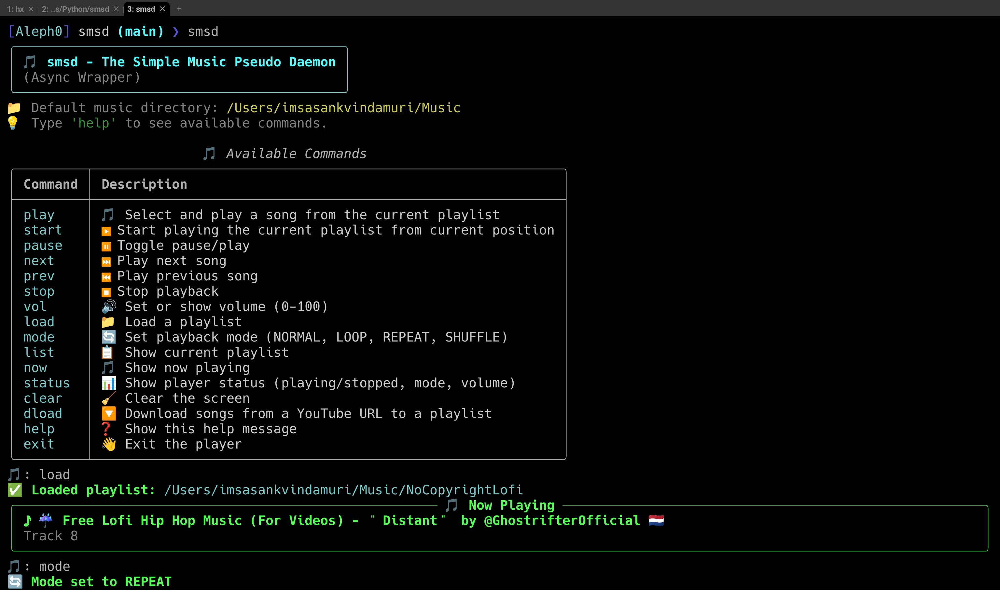

# smsd

The Simple Music Pseudo-Daemon



---

## Why did I make this?

I ran out of my Spotify and YT Music membership. So I decided to make a minimal
CLI for my music playing.

## Tech Stack

- Python bindings to VLC (`python-vlc`)
- Python bindings to the CLI fuzzy searcher (`pyfzf`)
- Rich (`rich`)
- Python's native yt-dlp bindings (`yt-dlp`)

## Features

- Searches the `~/Music` directory to look for files
- Can download music through `yt-dlp`
- Simple implementation that is offline by default

## Download

```
git clone https://github.com/imsasankvindamuri/smsd.git
cd smsd
pipx install .
```

Run using...

```
smsd
```

You need to have `vlc`, `yt-dlp`, `fzf`, and `ffmpeg` pre-installed.

This app is only compatible with Unix-like OSes due to the dependence
on `fzf` to mock a basic UI. Windows users may access the same using WSL.

## Basic Guide/Architecture Notes

The app treats all flat directories in the `~/Music` directory as valid playlists.

## License

This project is licensed under the [MIT License](./LICENSE). You’re free to use, modify,
and distribute it—just make sure to include the original license.

There’s no warranty or guarantee of any kind; use it at your own risk. See the full [LICENSE](./LICENSE)
file for details.

Credit is appreciated. If you enjoyed this prototype, consider contributing, forking, or
starring this repo. I'd really appreciate it.
